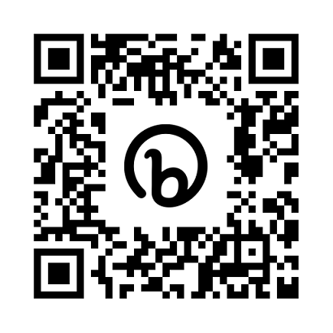

# talk-apache-cxf

This repository contains sample projects & documentation for the Apache CXF and WS-Security training.

* cxf-course-client: Client's configuration sample.
* cxf-course-server: Endpoint's configuration sample.
* soap_ui: Folder with sample projects with requests.
* docs: The presentation content. Live version is available here: https://bit.ly/talk-apache-cxf 
