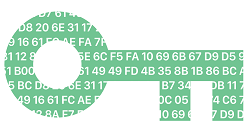
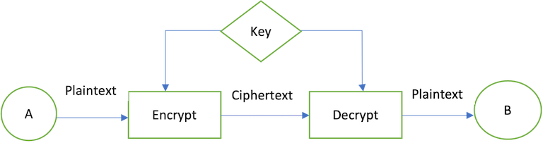
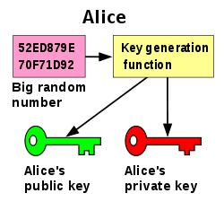
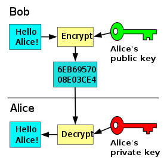
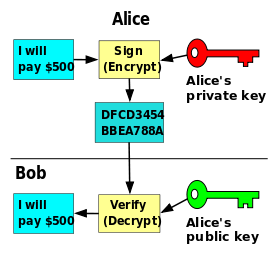

## Agenda
* Cryptography concepts
* Apache CXF
* Apache CXF - Integration with Spring Boot
* Developing a client/endpoint
* WS Security
* Testing

## Cryptography

Cryptography is **a method of protecting data and communications using codes and digital keys**  to ensure that the information is delivered untampered to the intended sender for further processing.



## Cryptography - Digital Signatures

A digital signature is a cryptographic means through which one can **verify** a document's **origin**, the **sender's identity**, the time, and date a document was signed or sent, etc.


## Cryptography - Plaintext/Ciphertext

As cryptography operates with data, this can be either in **plaintext** (cleartext) or **ciphertext** (cryptogram). 

Plaintext data means that the message is in natural format, readable to an attacker. Ciphertext data means that the message is in an unreadable format to the attacker but readable to the intended recipient.

## Cryptography - Encryption/Decryption

You can convert the message from plaintext to ciphertext using the process of **encryption**. 
Similarly, you can convert ciphertext into plaintext via **decryption** by using a cryptographic algorithm and key used to make the original message.

## Cryptography - Symmetric Encryption/Decryption

Symmetric or shared key encryption is a method where both parties share a key, kept secret by both parties. 
For example, sender A can encrypt a message with a shared key, then receiver B can decrypt the encrypted message only with that key.



## Cryptography - Asymmetric Encryption/Decryption

Asymmetrical encryption uses a pair of mathematical related keys, one for encryption and the other for decryption.
With public key cryptography, a user has a pair of public and private keys.

**Keys**: These are generated using a large prime number and a key function. The keys are related mathematically, but cannot be derived from one another.



## Cryptography - Asymmetric Encryption/Decryption

With these keys we can encrypt messages. For example, if Bob wants to send a message to Alice, he can encrypt a message using her public key. Alice can then decrypt this message using her private key. Only Alice can decrypt this message as she is the only one with the private key.



## Cryptography - Asymmetric Signing

Messages can also be signed. This allows you to ensure the authenticity of the message. If Alice wants to send a message to Bob, and Bob wants to be sure that it is from Alice, Alice can sign the message using her private key. Bob can then verify that the message is from Alice by using her public key.



## Key and Certificate Management Tool - Keytool

* Java includes the keytool utility in its releases. Another popular tool is `openssl` but which is not part of JDK.
* We can use `keytool` to manage keys and certificates and store them in a keystore. 
* The `keytool` command allows us to create self-signed certificates and show information about the keystore

```bash
# Generate test certificate
keytool -genkeypair -alias alice -keyalg RSA -keysize 2048 -dname "cn=CN, ou=OU, o=O, c=C" -validity 730 -storetype pkcs12 -keystore alice.p12 -keypass alice! -storepass alice! -v
# Export public key
keytool -export -rfc -keystore alice.p12 -alias alice -file alice.pem -storepass alice!
# Show certificate info
keytool -list -v -srcstoretype pkcs12 -J-Duser.language=en  -keystore alice.p12 -storepass alice!
# Create truststore
keytool -import -file alice.pem -alias alice -srcstoretype pkcs12 -keystore alice_trust.p12 -storepass alice! -J-Duser.language=en
# Convert PEM (pem/txt) to crt x509 (binary)
openssl x509 -inform PEM -in test_certificate.pem -out test_certificate.crt -outform DER
# Convert crt x509 (binary) to cer (pem/txt)
openssl x509 -inform DER -in certificate.cer -out certificate.pem
# Show certificate PEM info
openssl x509 -in certificate.pem -text
```

## Apache CXF - Introduction

* Apache CXF is an open source services framework.
* It supports multiple APIs like JAX-WS, JAX-RS.
* Compatible with protocols like SOAP, XML/HTTP, RESTful HTTP, and others
* It has integrations with popular Java frameworks like Spring Boot (include in this training) and Quarkus.

## Apache CXF - Spring Boot Integration

**Spring Boot** makes it easy to create stand-alone, production-grade Spring based Applications that you can "just run".

To integrate CXF with Spring boot we need to add the following dependencies: _spring-boot-starter-web_,_cxf-spring-boot-starter-jaxws_, _cxf-rt-transports-http_, _cxf-rt-ws-security_ and _cxf-rt-features-logging_.

## Developing a SOAP Client - Model generation (WSDL-first)

1. Download the WSDL file and place it in the resources' folder.
2. Use the maven _cxf-codegen-plugin_
 * Configure the _bindingFile_ for model generation. 
 * Configure the wsdlLocation.
 * Set the output path with _extraargs_
3. Use the _build-helper-maven-plugin_ to add the generated source to the project.

## Developing a SOAP Client - Spring Boot Configuration

1. Define in the `@Configuration` class a `@Bean` with the client implementation. It's the interface with the annotation `@WebService`.
2. Optional. If you want to use the client without CXF you need to use the class with the annotation `@WebServiceClient`.
2. Create a `JaxWsProxyFactoryBean` for the client class.
3. Assign Endpoint URL, and assign the Interceptors as needed. 

## Developing an Endpoint - Spring Boot Configuration

If the WSDL already exists, follow the _WSDL-first_ steps plus:

1. Define in the `@Configuration` class an `javax.xml.ws.Endpoint` implementation. It's the interface with the annotation `@WebService`.
2. Assign Endpoint URL, and Interceptors. 

## WS-Security - Concepts

**Web Services Security** (WS-Security, WSS) is an extension to SOAP to apply security to Web services.

Through a number of standards such as XML-Encryption, and headers defined in the WS-Security standard, it allows us to:

1. Encrypt messages or parts of messages
2. Sign messages
3. Timestamp messages
4. Pass authentication tokens between services
5. Manage public keys using XKMS

We'll cover the first three items using certificates. 
CXF relies on **Apache WSS4J™** in large part to implement WS-Security.

## WS-Security - Interceptors

To enable WS-Security within CXF for a server or a client, you'll need to set up the WSS4J interceptors.

```java
import org.apache.cxf.ws.security.wss4j.WSS4JInInterceptor;
import org.apache.cxf.ws.security.wss4j.WSS4JOutInterceptor;
...
 
Map<String,Object> inProps = new HashMap<String,Object>();
... // how to configure the properties is outlined below;
 
WSS4JInInterceptor wssIn = new WSS4JInInterceptor(inProps);
cxfEndpoint.getInInterceptors().add(wssIn);
 
Map<String,Object> outProps = new HashMap<String,Object>();
... // how to configure the properties is outlined below;
 
WSS4JOutInterceptor wssOut = new WSS4JOutInterceptor(outProps);
cxfEndpoint.getOutInterceptors().add(wssOut);
```

## WS-Security - X.509 Certificates

The X.509 Certificate Token Profile provides another option for implementing WS-Security. For the Signature and Encryption actions, we'll need to create a public & private key for the entities involved. We can generate a self-signed key pair for our development environment. Keep in mind these will not be signed by an external authority like Verisign, so are inappropriate for production use.

## WS-Security - Signing - Client side 1/2
On the client side, our outgoing WS-Security properties will look like so:

```java
outProps.put(WSHandlerConstants.ACTION, "Signature");
outProps.put(WSHandlerConstants.USER, "myAlias");
outProps.put(WSHandlerConstants.PW_CALLBACK_CLASS,
ClientCallbackHandler.class.getName());
outProps.put(WSHandlerConstants.SIG_PROP_FILE, "client_sign.properties");
```

The USER that is specified is the key alias for the client. The password callback class is responsible for providing that key's password. For X.509 support you will normally have multiple actions, e.g. Encryption with Signature. For these cases, just space-separate the actions in the ACTION property as follows:

`outProps.put(WSHandlerConstants.ACTION, WSHandlerConstants.TIMESTAMP + " " + WSHandlerConstants.SIGNATURE + " " + WSHandlerConstants.ENCRYPT);`


## WS-Security - Signing - Client side 2/2
Our client_sign.properties file contains several settings to configure WSS4J:

```java
org.apache.ws.security.crypto.provider=org.apache.ws.security.components.crypto.Merlin
org.apache.ws.security.crypto.merlin.keystore.type=jks
org.apache.ws.security.crypto.merlin.keystore.password=keyStorePassword
org.apache.ws.security.crypto.merlin.keystore.alias=myAlias
org.apache.ws.security.crypto.merlin.keystore.file=client_keystore.jks
```

## WS-Security - Signing - Server side

On the server side, we need to configure our incoming WSS4J interceptor to verify the signature using the Client's public key.

```java
inProps.put(WSHandlerConstants.ACTION, "Signature");
inProps.put(WSHandlerConstants.SIG_PROP_FILE, "server.properties");
```

Our server_sign.properties file contains several settings to configure WSS4J:
```java
org.apache.ws.security.crypto.provider=org.apache.ws.security.components.crypto.Merlin
org.apache.ws.security.crypto.merlin.keystore.type=jks
org.apache.ws.security.crypto.merlin.keystore.password=amex123
org.apache.ws.security.crypto.merlin.keystore.file=server_keystore.jks
```

## WS-Security - Encryption

Encryption involves the sender encrypting the message with the recipient's public key to ensure that only the recipient can read the message (only the recipient has its own private key, necessary for decrypting the message.) This requires the sender to have the recipient's public key in its keystore.

The process for encrypting is very similar to and indeed usually combined with the signature one.

## Testing

* Functional test with SOAP UI.
* Integration test with `@SpringBootTest` and MockServer.

## References

* [Introduction to Java Encryption/Decryption - Dev.java](https://dev.java/learn/security/intro/)
* [Apache CXF -- WS-Security](https://cxf.apache.org/docs/ws-security.html)
* [Spring Boot Reference Documentation](https://docs.spring.io/spring-boot/docs/current/reference/html/)
* [Security Best Practices](https://ws.apache.org/wss4j/best_practice.html)
* [WS-Security (WSS) for API Testing | SoapUI](https://www.soapui.org/docs/soapui-projects/ws-security/)
* [Running MockServer via a JUnit 5 Test Extension](https://www.mock-server.com/mock_server/running_mock_server.html#junit_test_extension)
